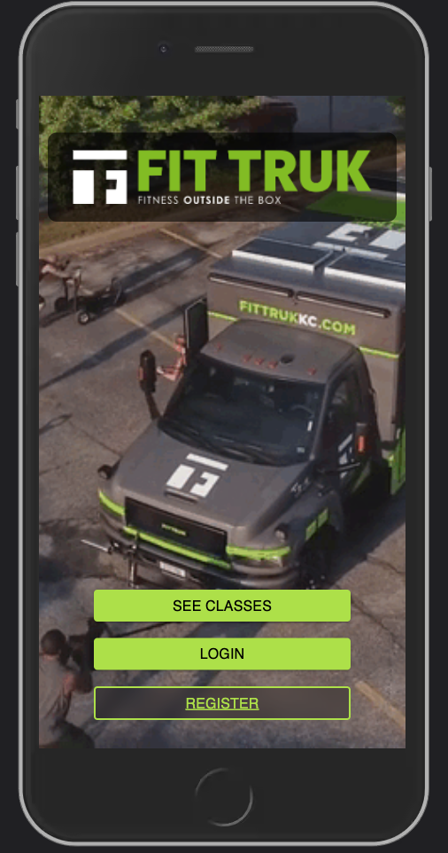
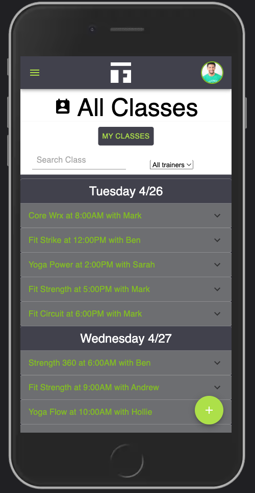
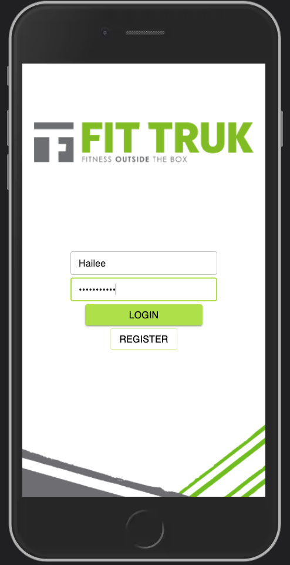
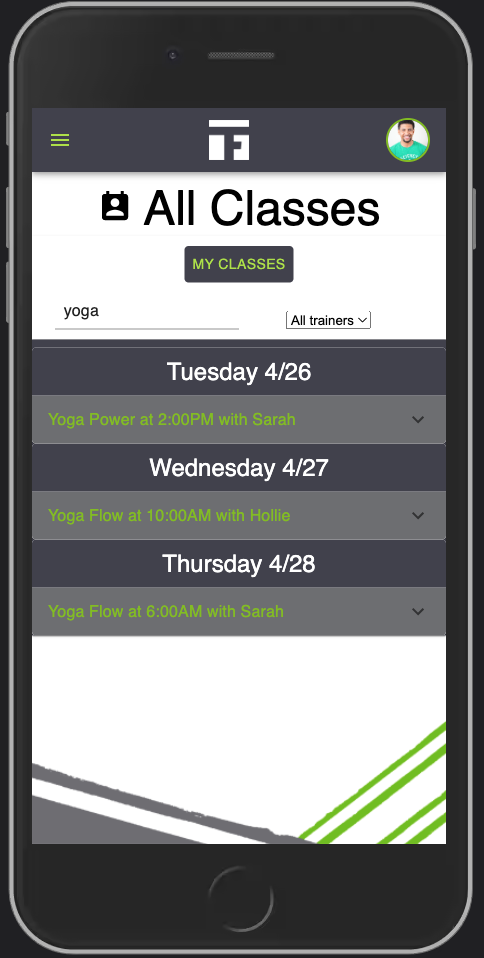
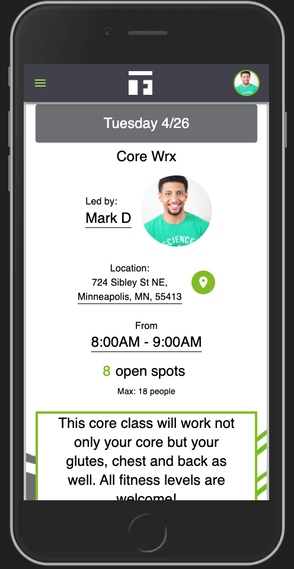
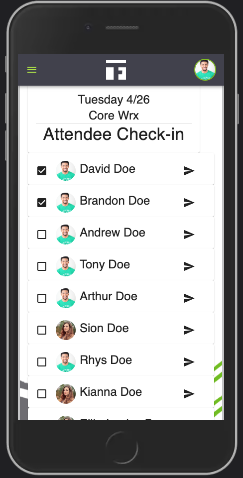
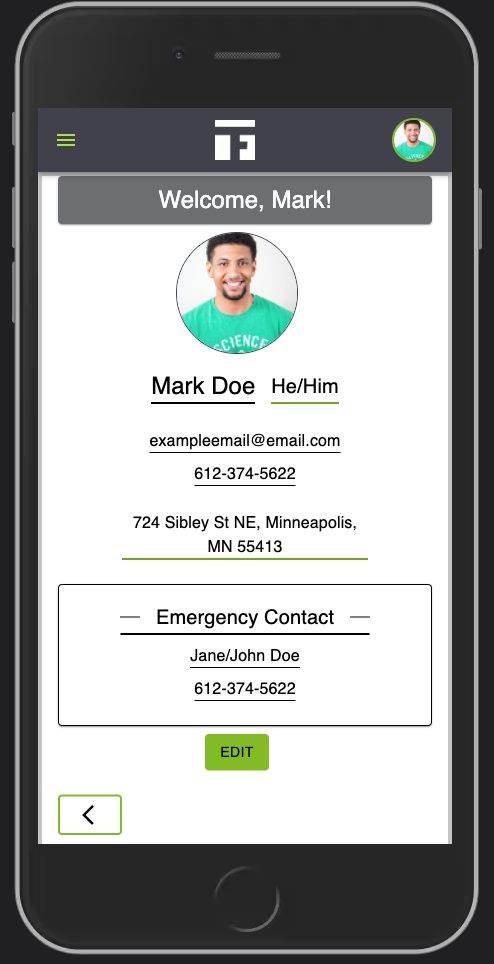

# FIT TRUK SCHEDULING APP

## Description

_Duration: 2 Week Sprint_


### _What led to Fit Truk?_
In 2020 the pandemic changed daily life for everyone. Life was more stressful, and to add to that people weren’t feeling comfortable exercising inside. Businesses strived to make the environment safe for their customers, but eventually non essential businesses, which includes gyms, were forced to close. Suddenly people weren’t able to have a healthy outlet to manage their stress, and when gyms were able to open back up, many people still felt uncertain about the safety of indoor gyms. This led our client to imagine a strength based, small group class format that could be done in a lower risk setting, that setting just happens to be outside.

Working out outside is nothing new, but it has always been very limited because of a lack of equipment, until now. Fit Truk is different. It is a fully equipped, mobile gym that delivers cutting edge group strength training workouts outdoors, anywhere, anytime. Simply put, it’s an innovative solution for outdoor strength training with all of the equipment you’d expect from a fully stocked professional gym.


### _What was the purpose behind this app?_
Having a mobile gym presents its own unique set of challenges. When our client was trying to find a scheduling app that catered to Fit Truk’s needs, there just weren't any good options. Scheduling apps on the market today only cater to more traditional gyms, gyms that aren't mobile. Imagine as a business owner trying to change your location every time your mobile gym is offering a class in another spot. Now imagine your business is growing and you're bringing on more trucks, the scheduling process with the current apps becomes tedious, unmanageable and overall doesn’t scale. Our client’s customers also found these apps to be very cumbersome to use, with their excess of features making it too difficult to find the information that they needed so they could simply sign up for a class.

Fit Truk is unlike any other gym, so when our client was trying to find a scheduling app that catered to Fit Truk’s needs, there just weren't any good options. Our client was unsatisfied with other fitness scheduling apps because they had way too many features, a lot of which wouldn't be used by Fit Truk and their customers. Our client’s customers found these apps to be frustrating and cumbersome to use. It was too difficult to find the information that they needed so they could simply sign up for a class. Other scheduling apps only cater to more traditional gyms, gyms that can’t move around. Imagine as a business owner trying to change their location on google maps every time their mobile gym is offering a class in another spot, it’s tedious and time consuming. Now imagine your business is growing and you're bringing on more new trucks, the scheduling process with the current app becomes unmanageable, and impossible to scale. 

These are just some of the challenges that Hailee was facing when imagining the perfect scheduling app for her and her business. And it was these challenges that helped us design that perfect app. An app that is user friendly, scalable, and easy to use.


The Fit Truk App improves the scheduling and signup experiences of trainers and customers alike.
Customers are able to see upcoming classes and register for them; While administrators are able to create new classes, update existing class info, track attendance, and send updates to class participants all while keeping with Fit Truks’ brand standards and maintaining an enjoyable and cohesive experience for the user.


To see the fully functional site, please visit: [DEPLOYED VERSION OF APP](www.heroku.com)


## Screen Shot









### Prerequisites

Software required to install the app.

- [Node.js](https://nodejs.org/en/)
- [Postgres](https://www.postgresql.org/download/)


## Installation

1. Create a database named `fittruk`,
2. The queries in the `database.sql` file are set up to create all the necessary tables and populate the needed data to allow the application to run correctly. The project is built on [Postgres](https://www.postgresql.org/download/), so you will need to make sure to have that installed. We recommend using Postico to run those queries as that was used to create the queries.
3. (OPTIONAL) Create a long string of random characters that can replace `superDuperSecret` in the code block below. Here's a site that can help: [https://passwordsgenerator.net/](https://passwordsgenerator.net/). If you don't do this step, create a secret with less than eight characters, or leave it as `superDuperSecret`, you will get a warning. If this is for testing purposes, then having a high security encryption key is not as necessary.
4. Create a `.env` file at the root of the project and paste this line into the file:
  ```
  SERVER_SESSION_SECRET=superDuperSecret
  ```
5. Open up your editor of choice and run an `npm install`
6. Run `npm run server` in your terminal
7. Run `npm run client` in your terminal, this command will open up a new browser tab for you!


## Usage

- Super Admin, FitTruk Staff, Adva Team: Has the ability to update global data
- Local Admin : Will have a group of local trainers under their umbrella. Creates classes and sets the class trainer, time, and location.
- Trainer : Can see class list, track attendance, send push notifications to individuals and group, update class description and location, update personal information, view their own upcoming classes they will instruct .
- Customer: Can see class list, class details, reserve classes, cancel reservations, view their own upcoming classes they will attend.


## Built With

- Javascript
- React 
- Redux 
- Sagas
- Material UI
- Node.js
- PostgresQL
- Axios
- Express


## Acknowledgement
We're especially thankful to our client, Fit Truk, for giving us such an awesome project to work on. We're also very thankful to [Prime Digital Academy](www.primeacademy.io) for equipping us with the skills we needed to build this app.


## Support
If you have suggestions or issues, please email any of us at krale006@umn.edu, alldayabdi@gmail.com, colinrjaworski.84@gmail.com, koffi.k.collins@gmail.com, or clay_webb@outlook.com.
